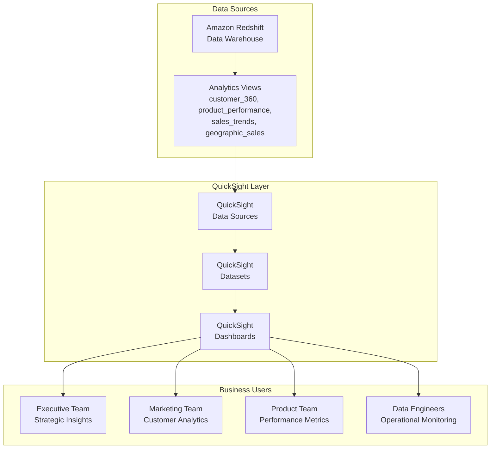

# 📊 Amazon QuickSight Dashboards

## 🎯 Overview

This document provides comprehensive information about the Amazon QuickSight dashboards implemented for the E-commerce Data Warehouse project. These dashboards provide real-time business intelligence and operational insights built on top of our Redshift data warehouse.

## 🏗️ Architecture



## 📈 Dashboard Portfolio

### 1. 🎯 Executive Dashboard
**Purpose:** High-level business KPIs and strategic insights for executive decision-making

**Key Metrics:**
- **Total Revenue** - Overall business performance
- **Total Active Customers** - Customer base size
- **Monthly Revenue Trend** - Growth trajectory analysis
- **Customer Segments** - Revenue distribution by segment
- **Top Products** - Best performing products by revenue

**Target Audience:** C-level executives, VPs, Directors
**Update Frequency:** Real-time (Direct Query)
**Data Sources:** Sales Trends, Customer 360, Product Performance

### 2. 👥 Customer Analytics Dashboard
**Purpose:** 360-degree customer view with segmentation and behavior analysis

**Key Metrics:**
- **Customer Lifetime Value** - Individual and average CLV
- **Customer Status Distribution** - Active, At Risk, Churned
- **RFM Analysis** - Recency, Frequency, Monetary segmentation
- **Customer Segments** - Premium, Standard, Basic performance
- **Top Customers** - Highest value customers by LTV

**Target Audience:** Marketing teams, Customer Success, Sales
**Update Frequency:** Real-time (Direct Query)
**Data Sources:** Customer 360 Analytics

### 3. 🛍️ Product Performance Dashboard
**Purpose:** Product analytics with sales performance and profitability insights

**Key Metrics:**
- **Product Revenue Rankings** - Top performing products
- **Category Performance** - Revenue by product category
- **Margin Analysis** - Profitability by product and category
- **Revenue vs Margin Scatter** - Performance quadrant analysis
- **Product Details Table** - Comprehensive product metrics

**Target Audience:** Product managers, Merchandising, Procurement
**Update Frequency:** Real-time (Direct Query)
**Data Sources:** Product Performance Analytics

### 4. ⚙️ Operational Dashboard
**Purpose:** Data engineering operational metrics and system health monitoring

**Key Metrics:**
- **Data Freshness** - How current is our data
- **System Health Score** - Overall system performance
- **Data Volume Trends** - Processing volume over time
- **ETL Performance** - Job success rates and timing
- **Data Quality Metrics** - Completeness and accuracy scores

**Target Audience:** Data engineers, DevOps, System administrators
**Update Frequency:** Real-time (Direct Query)
**Data Sources:** Sales Trends, Customer 360 (operational metrics)

## 🚀 Deployment Guide

### Prerequisites
1. **QuickSight Account** - Enterprise edition recommended
2. **Redshift Access** - VPC connection configured
3. **IAM Permissions** - QuickSight service role with Redshift access
4. **Python Environment** - For automated deployment

### Step 1: Infrastructure Deployment
```bash
# Deploy QuickSight infrastructure with Terraform
cd infrastructure/
terraform init
terraform plan -var="enable_quicksight=true"
terraform apply
```

### Step 2: Automated Dashboard Deployment
```bash
# Run the deployment script
cd infrastructure/modules/quicksight/scripts/
python deploy_dashboards.py \
  --project-name ecommerce-dwh \
  --environment dev \
  --region ap-south-1
```

### Step 3: Manual Configuration (if needed)
1. **Access QuickSight Console**
   - URL: https://ap-south-1.quicksight.aws.amazon.com/sn/start

2. **Verify Data Sources**
   - Check Redshift connection
   - Test dataset queries

3. **Configure Permissions**
   - Share dashboards with users
   - Set up user groups

## 📊 Dashboard Features

### Interactive Elements
- **Filters** - Date ranges, categories, segments
- **Drill-down** - Click to explore detailed data
- **Cross-filtering** - Selections affect multiple visuals
- **Export** - CSV, PDF export capabilities

### Visualization Types
- **KPI Cards** - Key performance indicators
- **Line Charts** - Trend analysis over time
- **Bar Charts** - Comparative analysis
- **Pie Charts** - Distribution analysis
- **Scatter Plots** - Correlation analysis
- **Tables** - Detailed data views
- **Gauge Charts** - Performance against targets

### Responsive Design
- **Desktop** - Full-featured experience
- **Tablet** - Optimized layouts
- **Mobile** - Essential metrics view

## 🔧 Maintenance & Operations

### Data Refresh
- **Direct Query** - Real-time data from Redshift
- **No SPICE** - Always current data
- **Performance** - Optimized views for fast queries

### Monitoring
- **Usage Analytics** - Track dashboard adoption
- **Performance Metrics** - Query execution times
- **Error Monitoring** - Failed queries and issues

### Updates & Versioning
- **Template-based** - JSON templates for consistency
- **Version Control** - Git-tracked dashboard definitions
- **Automated Deployment** - Python scripts for updates

## 👥 User Management

### User Roles
- **Admin** - Full dashboard management
- **Author** - Create and edit dashboards
- **Reader** - View dashboards only

### Access Control
- **Dashboard-level** - Control access per dashboard
- **Row-level Security** - Filter data by user attributes
- **Column-level** - Hide sensitive data

## 📈 Business Value

### Executive Benefits
- **Real-time Insights** - Current business performance
- **Strategic Planning** - Data-driven decision making
- **Performance Tracking** - KPI monitoring and alerts

### Operational Benefits
- **Self-service Analytics** - Reduced IT dependency
- **Faster Time-to-Insight** - Immediate data access
- **Cost Optimization** - Efficient resource utilization

### Technical Benefits
- **Scalability** - Handles growing data volumes
- **Integration** - Seamless Redshift connectivity
- **Automation** - Reduced manual processes

## 🔗 Related Documentation

- [Data Warehouse Schema](../sql/README.md)
- [Analytics Views](../sql/views/README.md)
- [Infrastructure Setup](../infrastructure/README.md)
- [Team Guide](TEAM_GUIDE.md)

## 📞 Support

### Technical Issues
- **Data Engineering Team** - Infrastructure and data issues
- **BI Team** - Dashboard functionality and design
- **AWS Support** - QuickSight service issues

### Training Resources
- [QuickSight User Guide](https://docs.aws.amazon.com/quicksight/)
- [Dashboard Best Practices](https://aws.amazon.com/quicksight/resources/)
- [Internal Training Materials](./training/)

---

**Last Updated:** 2025-01-11  
**Version:** 1.0  
**Maintained by:** Data Engineering Team
