# 🏗️ E-commerce Data Warehouse - Architecture Overview

## 🎯 **Architecture Vision**

This document provides a comprehensive overview of the enterprise-grade e-commerce data warehouse architecture. The architecture is designed to be:

- **Scalable** - Handles growing data volumes and user demands
- **Secure** - Enterprise-grade security and compliance
- **Reliable** - High availability and disaster recovery
- **Performant** - Optimized for analytics workloads
- **Cost-effective** - Efficient resource utilization
- **Maintainable** - DevOps automation and monitoring

## 📊 **Architecture Diagram**

```mermaid
graph TB
    %% Data Sources
    subgraph "Data Sources"
        CSV[📄 Sample Data<br/>CSV Files]
        API[🌐 Future APIs<br/>Real-time Data]
        DB[🗄️ Future Databases<br/>Transactional Systems]
    end

    %% Data Ingestion Layer
    subgraph "Data Ingestion & Storage"
        S3Raw[🪣 Amazon S3<br/>Raw Data Bucket<br/>ecommerce-dwh-dev-raw-data]
        S3Processed[🪣 Amazon S3<br/>Processed Data Bucket<br/>ecommerce-dwh-dev-processed-data]
        S3Scripts[🪣 Amazon S3<br/>Scripts Bucket<br/>ecommerce-dwh-dev-scripts]
        S3Logs[🪣 Amazon S3<br/>Logs Bucket<br/>ecommerce-dwh-dev-logs]
    end

    %% ETL Processing Layer
    subgraph "ETL & Data Processing"
        GlueCrawler[🕷️ AWS Glue Crawler<br/>Data Discovery<br/>Schema Detection]
        GlueETL[⚙️ AWS Glue Jobs<br/>Data Processing<br/>Quality Validation]
        GlueWorkflow[🔄 AWS Glue Workflows<br/>ETL Orchestration<br/>Scheduled at 2 AM UTC]
        StepFunctions[🚀 AWS Step Functions<br/>Advanced Orchestration<br/>Error Handling & Notifications<br/>Scheduled at 3 AM UTC]
        GlueCatalog[📚 AWS Glue Data Catalog<br/>Metadata Repository<br/>Schema Registry]
    end

    %% Data Warehouse Layer
    subgraph "Data Warehouse & Analytics"
        Redshift[🏢 Amazon Redshift<br/>ra3.xlplus Cluster<br/>Star Schema Design<br/>Staging + Dimensions + Facts]
        RedshiftSpectrum[🔍 Redshift Spectrum<br/>Query S3 Data<br/>Federated Queries]
    end

    %% Analytics & BI Layer
    subgraph "Business Intelligence & Analytics"
        QuickSight[📊 Amazon QuickSight<br/>4 Production Dashboards<br/>Real-time Analytics]
        ExecutiveDash[🎯 Executive Dashboard<br/>KPIs & Strategic Insights]
        CustomerDash[👥 Customer Analytics<br/>360° View & Segmentation]
        ProductDash[🛍️ Product Performance<br/>Sales & Profitability]
        OperationalDash[⚙️ Operational Dashboard<br/>ETL & System Monitoring]
    end

    %% Orchestration & Automation
    subgraph "Orchestration & Automation"
        EventBridge[⏰ Amazon EventBridge<br/>Event-Driven Automation<br/>Scheduled Triggers]
        Lambda[⚡ AWS Lambda<br/>Serverless Functions<br/>Custom Automation]
        SNS[📢 Amazon SNS<br/>Notifications<br/>Alerts & Monitoring]
    end

    %% Security & Compliance
    subgraph "Security & Compliance"
        IAM[🔐 AWS IAM<br/>Roles & Policies<br/>Least Privilege Access]
        KMS[🔑 AWS KMS<br/>Encryption Keys<br/>Data Protection]
        SecretsManager[🔒 AWS Secrets Manager<br/>Credential Management]
        Config[📋 AWS Config<br/>Compliance Monitoring<br/>Configuration Management]
        CloudTrail[🔍 AWS CloudTrail<br/>Audit Logging<br/>API Call Tracking]
        GuardDuty[🛡️ AWS GuardDuty<br/>Threat Detection<br/>Security Monitoring]
        SecurityHub[🏛️ AWS Security Hub<br/>Centralized Security<br/>Compliance Dashboard]
    end

    %% Monitoring & Observability
    subgraph "Monitoring & Observability"
        CloudWatch[📊 Amazon CloudWatch<br/>Metrics & Dashboards<br/>Log Aggregation]
        CloudWatchLogs[📝 CloudWatch Logs<br/>Centralized Logging<br/>Log Analysis]
        CloudWatchAlarms[🚨 CloudWatch Alarms<br/>Threshold Monitoring<br/>Automated Alerting]
    end

    %% Backup & Disaster Recovery
    subgraph "Backup & Disaster Recovery"
        Backup[💾 AWS Backup<br/>Automated Backups<br/>Cross-Region Replication]
        S3Replication[🔄 S3 Cross-Region<br/>Replication<br/>Disaster Recovery]
        RedshiftSnapshot[📸 Redshift Snapshots<br/>Point-in-Time Recovery<br/>Automated Backups]
    end

    %% DevOps & CI/CD
    subgraph "DevOps & CI/CD"
        GitHub[🐙 GitHub Actions<br/>CI/CD Pipelines<br/>Automated Deployments]
        Terraform[🏗️ Terraform<br/>Infrastructure as Code<br/>Multi-Environment]
        DevOpsDashboard[📊 DevOps Dashboard<br/>Operational Metrics<br/>Health Monitoring]
    end

    %% Network & Infrastructure
    subgraph "Network & Infrastructure"
        VPC[🌐 Amazon VPC<br/>Private Network<br/>Isolated Environment]
        SecurityGroups[🔒 Security Groups<br/>Firewall Rules<br/>Network Access Control]
        PrivateSubnets[🏠 Private Subnets<br/>Multi-AZ Deployment<br/>High Availability]
    end

    %% Data Flow Connections
    CSV --> S3Raw
    API --> S3Raw
    DB --> S3Raw
    
    S3Raw --> GlueCrawler
    GlueCrawler --> GlueCatalog
    GlueCatalog --> GlueETL
    GlueETL --> S3Processed
    S3Processed --> Redshift
    
    %% Orchestration Flow
    EventBridge --> GlueWorkflow
    EventBridge --> StepFunctions
    GlueWorkflow --> GlueCrawler
    GlueWorkflow --> GlueETL
    StepFunctions --> GlueCrawler
    StepFunctions --> GlueETL
    StepFunctions --> SNS
    
    %% Analytics Connections
    Redshift --> QuickSight
    QuickSight --> ExecutiveDash
    QuickSight --> CustomerDash
    QuickSight --> ProductDash
    QuickSight --> OperationalDash
    S3Processed --> RedshiftSpectrum
    RedshiftSpectrum --> Redshift
    
    %% Monitoring Connections
    GlueETL --> CloudWatch
    Redshift --> CloudWatch
    S3Raw --> CloudWatch
    CloudWatch --> CloudWatchAlarms
    CloudWatchAlarms --> SNS
    
    %% Security Connections
    IAM -.-> GlueETL
    IAM -.-> Redshift
    IAM -.-> S3Raw
    KMS -.-> S3Raw
    KMS -.-> Redshift
    SecretsManager -.-> Redshift
    Config --> SecurityHub
    CloudTrail --> SecurityHub
    GuardDuty --> SecurityHub
    
    %% Backup Connections
    Redshift --> Backup
    S3Raw --> S3Replication
    Redshift --> RedshiftSnapshot
    
    %% DevOps Connections
    GitHub --> Terraform
    Terraform --> VPC
    Terraform --> Redshift
    Terraform --> GlueETL
    DevOpsDashboard --> CloudWatch
    DevOpsDashboard --> SecurityHub
    DevOpsDashboard --> Backup

    %% Styling
    classDef s3 fill:#FF9900,stroke:#232F3E,stroke-width:2px,color:#fff
    classDef glue fill:#FF9900,stroke:#232F3E,stroke-width:2px,color:#fff
    classDef redshift fill:#3F48CC,stroke:#232F3E,stroke-width:2px,color:#fff
    classDef security fill:#DD344C,stroke:#232F3E,stroke-width:2px,color:#fff
    classDef monitoring fill:#FF9900,stroke:#232F3E,stroke-width:2px,color:#fff
    classDef analytics fill:#3F48CC,stroke:#232F3E,stroke-width:2px,color:#fff
    classDef devops fill:#232F3E,stroke:#FF9900,stroke-width:2px,color:#fff
    classDef network fill:#FF9900,stroke:#232F3E,stroke-width:2px,color:#fff

    class S3Raw,S3Processed,S3Scripts,S3Logs,S3Replication s3
    class GlueCrawler,GlueETL,GlueWorkflow,GlueCatalog glue
    class Redshift,RedshiftSpectrum,RedshiftSnapshot redshift
    class IAM,KMS,SecretsManager,Config,CloudTrail,GuardDuty,SecurityHub security
    class CloudWatch,CloudWatchLogs,CloudWatchAlarms,SNS monitoring
    class QuickSight,Tableau,PowerBI,CustomApps analytics
    class GitHub,Terraform,DevOpsDashboard devops
    class VPC,SecurityGroups,PrivateSubnets network
```



## 🏗️ **Architecture Layers**

### **1. Data Sources Layer**
- **Sample Data** - CSV files with e-commerce data
- **Future APIs** - Real-time data integration points
- **Transactional Systems** - Future integration with OLTP systems

### **2. Data Ingestion & Storage Layer**
- **Raw Data Bucket** - Initial landing zone for all data
- **Processed Data Bucket** - Transformed and validated data
- **Scripts Bucket** - ETL scripts and code
- **Logs Bucket** - Centralized logging storage

### **3. ETL & Data Processing Layer**
- **Glue Crawler** - Automatic schema discovery
- **Glue ETL Jobs** - Data transformation and validation
- **Glue Workflows** - Native ETL orchestration (2 AM UTC)
- **Step Functions** - Advanced orchestration with error handling (3 AM UTC)
- **Glue Data Catalog** - Centralized metadata repository

### **4. Data Warehouse Layer**
- **Amazon Redshift** - ra3.xlplus cluster with star schema
- **Redshift Spectrum** - Query data directly in S3

### **5. Business Intelligence & Analytics Layer**
- **Amazon QuickSight** - 4 production-ready dashboards with real-time data
  - **Executive Dashboard** - Strategic KPIs, revenue trends, business insights
  - **Customer Analytics** - 360° customer view, RFM analysis, churn prediction
  - **Product Performance** - Sales rankings, profitability, category analysis
  - **Operational Dashboard** - ETL monitoring, system health, data quality
- **Direct Query** - Real-time data access without SPICE costs
- **Interactive Features** - Filters, drill-down, export capabilities
- **Mobile Responsive** - Professional dashboards for all devices

### **6. Orchestration & Automation Layer**
- **EventBridge** - Scheduled and event-driven triggers
- **Lambda** - Serverless automation functions
- **SNS** - Notifications and alerts

### **7. Security & Compliance Layer**
- **IAM** - Identity and access management
- **KMS** - Encryption key management
- **Secrets Manager** - Secure credential storage
- **Config** - Compliance monitoring
- **CloudTrail** - Audit logging
- **GuardDuty** - Threat detection
- **Security Hub** - Centralized security management

### **8. Monitoring & Observability Layer**
- **CloudWatch** - Metrics and dashboards
- **CloudWatch Logs** - Centralized logging
- **CloudWatch Alarms** - Automated alerting

### **9. Backup & Disaster Recovery Layer**
- **AWS Backup** - Automated backup management
- **S3 Cross-Region Replication** - Disaster recovery
- **Redshift Snapshots** - Point-in-time recovery

### **10. DevOps & CI/CD Layer**
- **GitHub Actions** - CI/CD pipelines
- **Terraform** - Infrastructure as Code
- **DevOps Dashboard** - Operational metrics

### **11. Network & Infrastructure Layer**
- **VPC** - Private network isolation
- **Security Groups** - Firewall rules
- **Private Subnets** - Multi-AZ deployment

## 📊 **Data Flow Architecture**

### **ETL Pipeline Flow**
```
1. Raw data lands in S3 Raw Bucket
2. EventBridge triggers Glue Workflow or Step Functions
3. Glue Crawler discovers and catalogs schema
4. Glue ETL jobs process and validate data
5. Processed data stored in S3 Processed Bucket
6. Data loaded into Redshift tables
7. Analytics views and reports generated
```

### **Dual Orchestration Methods**
1. **AWS Glue Workflows** (2 AM UTC)
   - Native integration with Glue services
   - Simple workflow management
   - Visual workflow designer

2. **AWS Step Functions** (3 AM UTC)
   - Advanced error handling
   - Complex conditional logic
   - SNS notifications
   - Comprehensive retry mechanisms

## 🔒 **Security Architecture**

### **Defense-in-Depth Approach**
- **Network Security** - VPC, security groups, private subnets
- **Identity Security** - IAM roles with least privilege
- **Data Security** - Encryption at rest and in transit
- **Application Security** - Secure coding practices
- **Monitoring Security** - GuardDuty, CloudTrail, Config

### **Encryption Strategy**
- **S3 Buckets** - Server-side encryption with KMS
- **Redshift** - Cluster encryption with KMS
- **Data in Transit** - TLS 1.2+
- **Secrets** - Encrypted with Secrets Manager

## 💾 **Backup & Disaster Recovery**

### **Backup Strategy**
- **Redshift** - Automated snapshots (daily)
- **S3 Data** - Versioning and cross-region replication
- **Configuration** - AWS Backup with retention policies

### **Disaster Recovery**
- **RPO (Recovery Point Objective)** - < 24 hours
- **RTO (Recovery Time Objective)** - < 4 hours
- **Cross-Region Recovery** - ap-south-1 to ap-southeast-1

## 📈 **Scaling Strategy**

### **Vertical Scaling**
- **Redshift** - Upgrade node type (ra3.xlplus → ra3.4xlarge)
- **Glue** - Increase DPU allocation

### **Horizontal Scaling**
- **Redshift** - Add nodes (1 → 2 → 4 → 8)
- **Glue** - Parallel job execution

## 🚀 **Future Architecture Extensions**

### **Real-time Data Processing**
- **Kinesis** - Real-time data streaming
- **Glue Streaming ETL** - Stream processing

### **Machine Learning Integration**
- **SageMaker** - ML model training and deployment
- **Redshift ML** - In-database machine learning

### **Global Deployment**
- **Multi-Region** - Global data distribution
- **Route 53** - Global DNS routing

## 📊 **Architecture Metrics**

### **Performance Metrics**
- **Query Performance** - < 10 seconds for analytics queries
- **ETL Processing Time** - < 30 minutes for full refresh
- **Data Freshness** - < 24 hours

### **Reliability Metrics**
- **Availability** - 99.9% uptime
- **Backup Success Rate** - 99%+
- **Recovery Success Rate** - 99%+

### **Security Metrics**
- **Compliance Score** - 95%+
- **Vulnerability Remediation** - < 24 hours
- **Security Findings** - < 5 active findings

## 🎯 **Architecture Decisions**

### **Why Amazon Redshift?**
- **Performance** - Optimized for analytics workloads
- **Scalability** - Handles growing data volumes
- **Integration** - Native AWS ecosystem integration
- **Cost** - Pay-as-you-go pricing model

### **Why Dual Orchestration?**
- **Reliability** - Redundant orchestration methods
- **Flexibility** - Different capabilities for different needs
- **Future-Proofing** - Options for different use cases

### **Why Terraform?**
- **Infrastructure as Code** - Version-controlled infrastructure
- **Multi-Environment** - Consistent deployment across environments
- **Modularity** - Reusable infrastructure components
- **Automation** - CI/CD integration

---

## 🏆 **Architecture Summary**

This enterprise-grade e-commerce data warehouse architecture provides:

- **Scalable Analytics** - Handles growing data volumes and user demands
- **Enterprise Security** - Comprehensive security and compliance
- **High Availability** - Multi-AZ deployment with disaster recovery
- **Automation** - End-to-end DevOps automation
- **Cost Optimization** - Efficient resource utilization
- **Future-Proof Design** - Extensible for future requirements

The architecture follows AWS best practices and industry standards to deliver a world-class data warehouse solution that rivals implementations at Fortune 500 companies.
